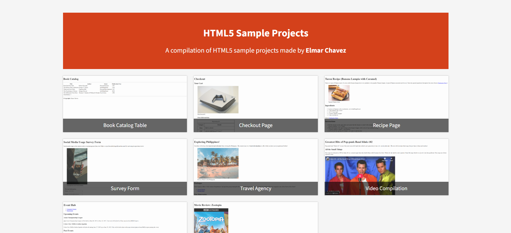

# 💻 HTML5 Sample Projects Compilation

## ℹ️ My HTML5 freeCodeCamp Projects Compilation Website

This website is a curated collection of **8 beginner-friendly HTML5 projects**, created by the author during his **first month of learning frontend web development** in [freeCodeCamp.com](https://www.freecodecamp.org/) under their HTML5 free course.

---

## 🔍 Overview

This project serves as a learning archive and public showcase. It features a custom-built responsive homepage that links to each individual project. The purpose is to demonstrate foundational frontend skills, layout structure, semantic tags, and beginner-level accessibility.

---

## 📚 Included Projects

- [**Book Catalog Table**](REPO_LINK) — A semantic table layout for displaying book details
- [**Checkout Page**](REPO_LINK) — A simulated e-commerce form page
- [**Recipe Page**](REPO_LINK) — An instructional cooking layout using sections and lists
- [**Survey Form**](REPO_LINK) — A sample form using labels and inputs with basic validation
- [**Travel Agency Page**](REPO_LINK) — A promotional landing page layout
- [**Video Compilation**](REPO_LINK) — A page displaying embedded videos in a structured layout
- [**Event Hub**](REPO_LINK) — A listing page for fictional events using semantic tags
- [**Movie Review**](REPO_LINK) — A static review page of _Zootopia (2016)_ with metadata and cast list

---

## 🧠 What I Learned

- How to structure a page using semantic HTML5 (`<main>`, `<section>`, `<article>`, `<footer>`, etc.)
- Accessibility basics including `alt`, `aria-label`, and logical heading structure
- How to organize multiple projects into a unified website
- The importance of Open Graph and meta tags for sharing and discoverability

---

## 🛠️ Tech Used

- HTML5
- CSS3
- Git
- GitHub
- Netlify

---

## 🚀 How to Run

1. Clone the repository
2. Open `index.html` in your browser

---

## 🌐 Live Demo

Or you can check out the 👉 [live website here](SITE_LINK)

---

## 🧑‍💻 Author

Created by **Elmar Chavez**

🗓️ Month/Year: **April 2025**

📚 Journey: **1st** month of learning _frontend web development_.
